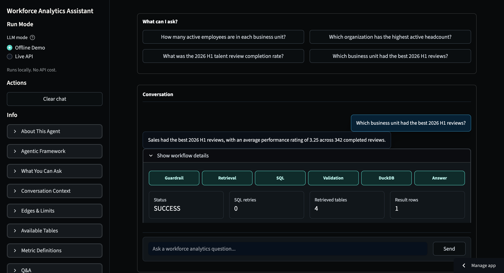

# Workforce Analytics Assistant

[](https://github.com/Yu6788/Text2SQL-AIAgent-workforce-analytics-assistant/actions/workflows/tests.yml)

A Streamlit-based Text-to-SQL agent for synthetic workforce analytics. The app lets a user ask workforce questions in natural language, inspect the generated SQL workflow, and receive a concise natural-language answer.

All business data is synthetic. No real employee, company, salary, protected attribute, or PII data is used.

## Live Demo

Open the deployed Streamlit app:

```text
https://text2sql-aiagent-workforce-analytics-assistant-8phrvf5mmjdmxrb.streamlit.app/
```

Use `Live API` mode for the strongest Text-to-SQL behavior. Use `Offline Demo` for a cost-free deterministic path.

## Preview



## Documentation

Read these first:

- `README.md`: project overview and quick start.
- `DETAILED_INSTRUCTIONS.md`: product guide, demo script, and user exploration instructions.
- `ENGINEERING_ARCHITECTURE.md`: engineering architecture for technical reviewers.
- `DATA_GUIDE.md`: dataset explanation, table relationships, metric definitions, and question families.

Historical planning notes and phase specs are retained in `docs/archive/`. Some archived files reference the synthetic company name `Atlas Workforce Solutions`; the current product-facing name is `Workforce Analytics Assistant`.

## What It Demonstrates

- Natural-language workforce analytics questions
- Schema-aware Text-to-SQL generation
- Agentic workflow with guardrails, retrieval, validation, execution, and repair
- Read-only DuckDB execution over synthetic HR/workforce data
- Inspectable SQL and intermediate pipeline details
- Current-session follow-up questions
- Offline deterministic demo mode plus Live API mode

## Example Questions

These questions are designed for the main Streamlit UI:

```text
How many active employees are in each business unit?
Which organization has the highest active headcount?
What was the 2026 H1 talent review completion rate?
Which business unit had the best 2026 H1 reviews?
```

Additional examples:

```text
Which development program had the highest completion rate?
Did Leadership Development completion correlate with later promotions?
What percentage of active employees is in each business unit?
```

## Demo Script

For a clean presentation, use a fixed path instead of asking random questions.

1. Start in `Live API` mode.
2. Ask: `How many active employees are in each business unit?`
3. Ask a follow-up: `What about Technology?`
4. Ask: `Which organization has the highest active headcount?`
5. Ask: `What was the 2026 H1 talent review completion rate?`
6. Ask: `Which business unit had the best 2026 H1 reviews?`
7. Open `Show workflow details` under an answer and point out retrieval, SQL, validation, DuckDB result, and repair details.
8. Optional guardrail demo: `What is the weather today?`

## Agentic Framework

```text
User question
  -> Guardrail
  -> Schema retrieval
  -> SQL generation
  -> SQL validation
  -> DuckDB execution
  -> SQL repair, if needed
  -> Natural-language summary
```

The workflow is intentionally inspectable. The user can see generated SQL, validation results, retrieved tables, database output, and repair attempts.

## Data Scope

The synthetic dataset covers workforce analytics from 2024 through 2026.

Tables:

- `employees`
- `organizations`
- `talent_reviews`
- `development_programs`
- `employee_programs`
- `internal_moves`

Good-fit questions include:

- Active headcount by business unit, organization, or status
- Talent review completion and review outcomes
- Development program enrollment and completion
- Promotion and mobility trends
- Aggregate comparisons across workforce groups

Out of scope:

- Real employee records
- Salaries or private employee details
- Protected attributes
- Weather, market data, current events, or external facts
- Legal, HR policy, or employment advice

## Conversation Context

The app keeps the current Streamlit session in memory while the page stays open. After a full first question, short follow-ups can reuse the previous turn.

Examples:

```text
What about Technology?
Show percentages instead.
Compare that with Sales.
```

Use `Clear chat` to start over. Long-term chat history is not persisted.

## Run Locally

Install dependencies:

```bash
python3 -m pip install -r requirements.txt
```

Optional retrieval/evaluation dependencies:

```bash
python3 -m pip install -r requirements-optional.txt
```

Launch the Streamlit app:

```bash
streamlit run app.py
```

Run the deterministic offline workflow:

```bash
python3 scripts/run_stub_workflow.py \
  "How many active employees are in each business unit?"
```

Run tests:

```bash
python3 -m pytest -q
```

## Live API Configuration

Offline Demo mode does not require an API key.

For Live API mode, create a local `.env` file based on `.env.example`:

```env
LLM_PROVIDER=openai_compatible
LLM_MODEL=<model-id>
LLM_API_KEY=<your-api-key>
LLM_BASE_URL=<provider-base-url>
```

For DeepSeek-style OpenAI-compatible APIs, use the provider's OpenAI-compatible base URL and model name.

Never commit `.env`.

## Streamlit Community Cloud Deployment

Deploy from GitHub with `app.py` as the Streamlit entrypoint. Use Python 3.11 or 3.12, and add API credentials through Streamlit Secrets using `streamlit_secrets.example.toml` as the template.

The synthetic DuckDB database, generated CSVs, and metadata are intentionally included so the app can start without running data-generation scripts at deploy time.

## Repository Layout

```text
.
|-- app.py
|-- config.yaml
|-- requirements.txt
|-- DATA_GUIDE.md
|-- data/
|-- docs/archive/
|-- metadata/
|-- evaluation/
|-- scripts/
|-- src/atlas_workforce/
|   |-- config/
|   |-- evaluation/
|   |-- graph/
|   |-- llm/
|   |-- prompts/
|   |-- rag/
|   `-- sql/
`-- tests/
```

## Evaluation Snapshot

Current local test status:

```text
50 passed, 1 warning
```

Stub evaluation is intentionally limited because Offline Demo uses deterministic SQL rules. Live API mode is broader and has been smoke-tested on the main example questions.

## Notes And Limitations

- English questions only.
- Synthetic six-table V1 schema.
- Offline Demo is deterministic and intentionally narrow.
- Live API quality depends on the configured provider and model.
- The app is a portfolio/demo project, not a production HR system.
- DuckDB execution is read-only and result-capped.
